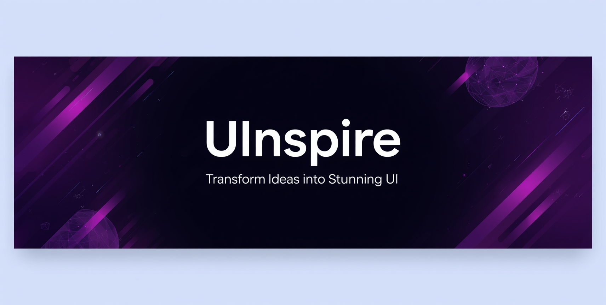
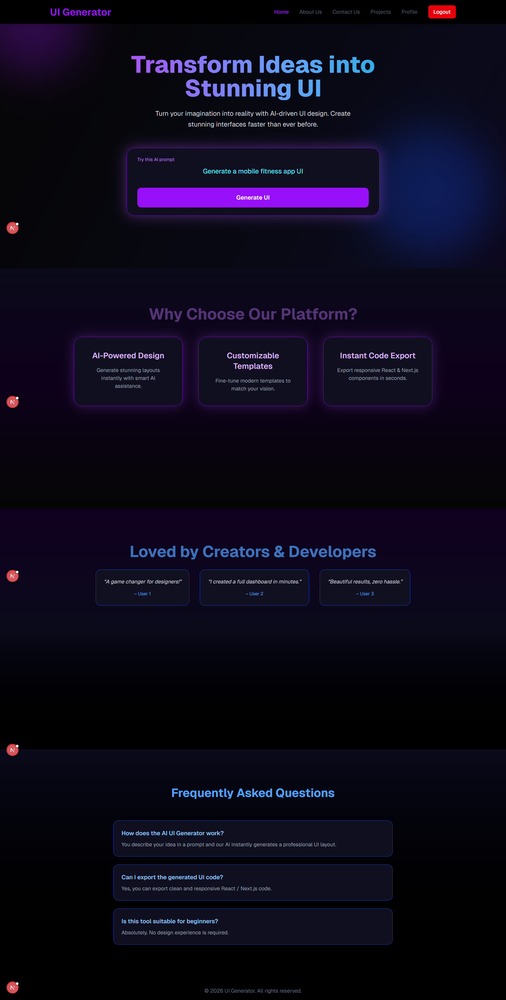

<div align="center">


# ✨ UInspire — AI-Powered UI Generator

**Transform ideas into stunning UI with the power of AI.**  
Describe what you want. Watch it come to life.

[](https://u-inspire-rust.vercel.app/)
[](https://github.com/YashiBuildss/UInspire/stargazers)
[](LICENSE)


</div>

---

## 🚀 What is UInspire?

**UInspire** is an AI-driven UI generation platform where you describe the interface you need in plain English, and the AI instantly generates clean, responsive **React / Next.js** code with a live preview — no design experience required.

> *"Turn your imagination into reality with AI-driven UI design. Create stunning interfaces faster than ever before."*

---

## 🎥 Features at a Glance

| Feature | Description |
|---|---|
| 🤖 **AI UI Generation** | Describe any UI in plain text and get production-ready HTML/CSS code instantly |
| 👁️ **Live Preview** | See your generated UI rendered in real-time side by side with the code |
| ✏️ **Code Editor** | Edit the generated code directly in the browser |
| 💾 **Save Projects** | Save your generated UIs to your personal project dashboard |
| 📋 **Copy & Export** | Copy code to clipboard or save it for later use |
| 📁 **Project Dashboard** | Manage all your generated UIs in one place |
| 👤 **User Auth** | Secure login/signup with personal project history |

---

## 🖥️ Screenshots

<details>
<summary>🏠 Home Page</summary>
<br/>



> AI prompt input, feature highlights, testimonials & FAQ

</details>

<details>
<summary>⚙️ Project Generator</summary>
<br/>


> Side-by-side code editor and live preview with Regenerate & Reset controls

</details>

<details>
<summary>📁 Project Dashboard</summary>
<br/>


> View, manage, and create all your generated UI projects

</details>

<details>
<summary>Generated UI</summary>
<br/>


> 

</details>
<details>
<summary>Profile Page</summary>
<br/>


> 

</details>

---

## 🛠️ Tech Stack

**Frontend**


**Backend & Auth**


**AI**


---

## ⚡ Getting Started

```bash
# 1. Clone the repository
git clone https://github.com/YashiBuildss/UInspire.git

# 2. Navigate into the project
cd UInspire

# 3. Install dependencies
npm install

# 4. Set up environment variables
cp .env.example .env.local
# Add your API keys in .env.local

# 5. Run the development server
npm run dev
```

Open [http://localhost:3000](http://localhost:3000) in your browser.

---

## 🔑 Environment Variables

Create a `.env.local` file in the root:

```env
MONGODB_URI=your_mongodb_connection_string
NEXTAUTH_SECRET=your_nextauth_secret
GEMINI_API_KEY=your_gemini_api_key
```

---

## 📁 Project Structure

```
UInspire/
├── app/
│   ├── page.js              # Home page
│   ├── about/               # About Us page
│   ├── contact/             # Contact page
│   └── user/
│       ├── generator/       # AI UI Generator
│       └── projectHistory/  # Project Dashboard
├── components/              # Reusable components
├── lib/                     # DB & utility functions
└── public/                  # Static assets
```

---

## 🤝 Contributing

Contributions are welcome! Feel free to open an issue or submit a pull request.

1. Fork the repo
2. Create your feature branch (`git checkout -b feature/amazing-feature`)
3. Commit your changes (`git commit -m 'Add amazing feature'`)
4. Push to the branch (`git push origin feature/amazing-feature`)
5. Open a Pull Request

---

## 📬 Contact

<a href="https://mail.google.com/mail/?view=cm&to=yashiporwal.dev@gmail.com">
  
</a>
<a href="https://www.linkedin.com/in/yashi-porwal/">
  
</a>

---

<div align="center">

Made with 💜 by [Yashi Porwal](https://github.com/YashiBuildss)

⭐ Star this repo if you found it helpful!

</div>
